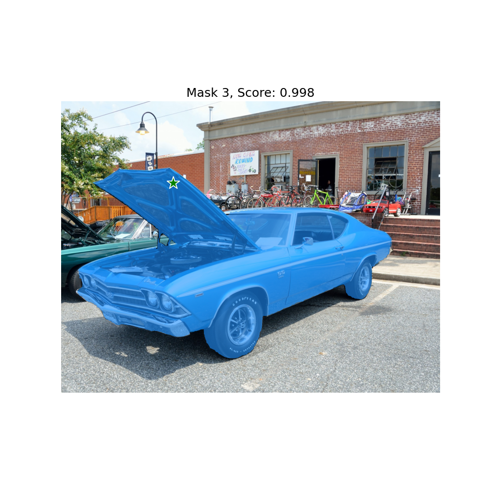

# ROS SAM

This package is what the name suggests: Meta's `segment-anything` wrapped in a ROS node. In this wrapper we offer...

 - ROS services for segmenting images using point and box queries.
 - An RQT interface for specifying point queries interactively.
 - A Python client which handles the serialization of queries.


## Installation

Installation is easy: 
 1. Start by cloning this package into your ROS environment. 
 2. Download the [checkpoints](https://github.com/facebookresearch/segment-anything#model-checkpoints) for the desired SAM models to the `models` directory in this package.
 3. Install SAM by running `pip install git+https://github.com/facebookresearch/segment-anything.git`.


## Using ROS SAM standalone

Run the SAM ROS node using `rosrun`:

```bash
rosrun ros_sam sam_node.py
```

The node has two parameters:
 - `~model` SAM model to use, defaults to `vit_h`. Check SAM documentation for options.
 - `~cuda` whether to use CUDA and which device, defaults to `cuda`. Use `cpu` if you have no CUDA.If you want to use a specific GPU, set someting like `cuda:1`.

The node currently offers a single service `ros_sam/segment` which can be called to segment an image. Check `rossrv show ros_sam/Segmentation` for request and response specifications.

You can test SAM by starting the node and then running `rosrun ros_sam sam_test.py`. This should yield the following result:




### ROS Services

`ros_sam` offers a single service `segment` of the type `ros_sam/Segmentation.srv`. The service definition is
```
sensor_msgs/Image        image            # Image to segment
geometry_msgs/Point[]    query_points     # Points to start segmentation from
int32[]                  query_labels     # Mark points as positive or negative samples
std_msgs/Int32MultiArray boxes            # Boxes can only be positive samples
bool                     multimask        # Generate multiple masks
bool                     logits           # Send back logits

---

sensor_msgs/Image[]   masks            # Masks generated for the query
float32[]             scores           # Scores for the masks
sensor_msgs/Image[]   logits           # Logit activations of the masks
```

The service request takes input image, input point prompts, corresponding labels and the box prompt. The service response contains the segmentation masks, confidence scores and the logit activations of the masks.

To learn more about the types and use of different queries, please refer to the [original SAM tutorial](https://github.com/facebookresearch/segment-anything/blob/main/notebooks/predictor_example.ipynb)

The service calls are wrapped up conveniently in the ROS SAM client.


## Using with RQT click interface

To use the GUI install the following in your ROS workspace:

[rqt_image_view_seg](https://github.com/ipab-slmc/rqt_image_view_seg)

Run the launch file:

`roslaunch ros_sam gui_test.launch`

Check the terminal and wait until the SAM model has finished loading.

There will be two windows loaded. One will have the header `rqt_image_view_seg__ImageView` and the other `rqt_image_view__ImageView`, note the lack of `_seg`. The first window is where you should click, so select the topic of the camera you want to view from the drop down. In the second window you should select `/rqt_image_segmentation/masked_image`. This is where the segmented image will be displayed.


## Using ROS SAM client

Alternatively, if you don't feel like assembling the service calls yourself, one can use the ROS SAM client instead of the service calls.

Initialize the client with the service name of the SAM segmentation service
```python
from ros_sam import SAMClient
sam_client = SAMClient('ros_sam')
```

Call the segment method with the input image, input prompt points and corresponding labels. This returns 3 segmentation masks for the object and their corresponding confidence scores
```python
img = cv2.imread('path/to/image.png')
points = np.array([[100, 100], [200, 200], [300, 300]])
labels = [1, 1, 0]
masks, scores = sam_client.segment(img, points, labels)
```

Additional utilities for visualizing segmentation masks and input prompts
```python
from ros_sam import show_mask, show_points
show_mask(masks[0], plt.gca())
show_points(points, np.asarray(labels), plt.gca())
```

## Citing ROS SAM
If you use ROS SAM in your work, please cite our paper:
```
@article{buchanan2023online,
  title={Online Estimation of Articulated Objects with Factor Graphs using Vision and Proprioceptive Sensing},
  author={Buchanan, Russell and R{\"o}fer, Adrian and Moura, Jo{\~a}o and Valada, Abhinav and Vijayakumar, Sethu},
  journal={arXiv preprint arXiv:2309.16343},
  year={2023}
}
```
And please also cite the original Segment Anything paper:
```
@article{kirillov2023segany,
  title={Segment Anything},
  author={Kirillov, Alexander and Mintun, Eric and Ravi, Nikhila and Mao, Hanzi and Rolland, Chloe and Gustafson, Laura and Xiao, Tete and Whitehead, Spencer and Berg, Alexander C. and Lo, Wan-Yen and Doll{\'a}r, Piotr and Girshick, Ross},
  journal={arXiv:2304.02643},
  year={2023}
}
```
